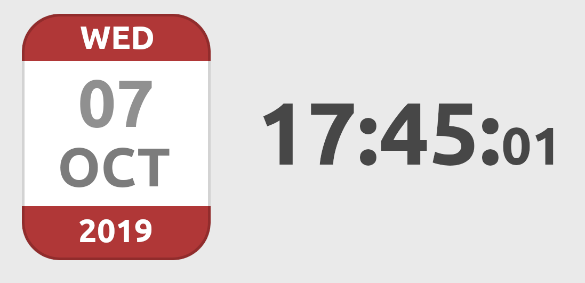

### Exercise 1

Find the timezones of :
- Anchorage (USA)
- Reykjavik (Iceland)
- Saint-Petersburg (Russia)

And display the date and time of these cities along with the time and date of Brussels.

### Exercise 2

Using timestamps, find how many days have passed since the date of your birth. Feeling old, yet?

Write a function to find how many days have passed since any point in time (after 1970).

### Exercise 3

Using timestamps, find the exact time and date we will be in 80000 hours.

Write a function to display the time and date for any amount of hours given in the future. Create a [number input](https://developer.mozilla.org/fr/docs/Web/HTML/Element/Input/number) for the hours and listen for `keyup` events, dynamically display the date in the number of hours given by the input.

### Exercise 4

Using HTML, CSS (and javascript, of course) reproduce the following picture. This should be centered both horizontaly and vertically in your page.

