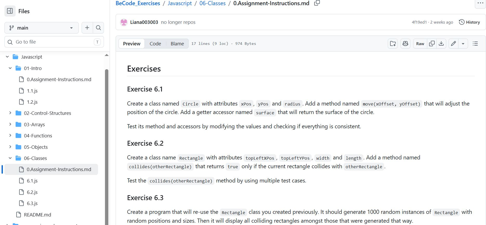
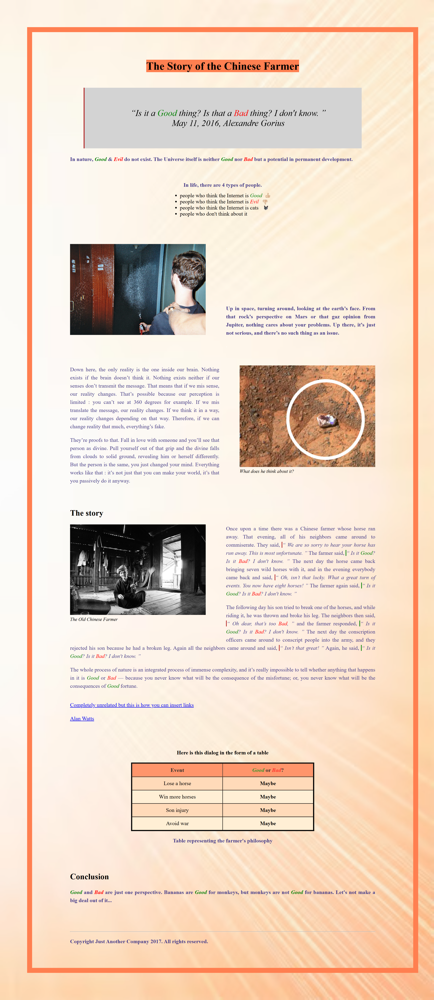
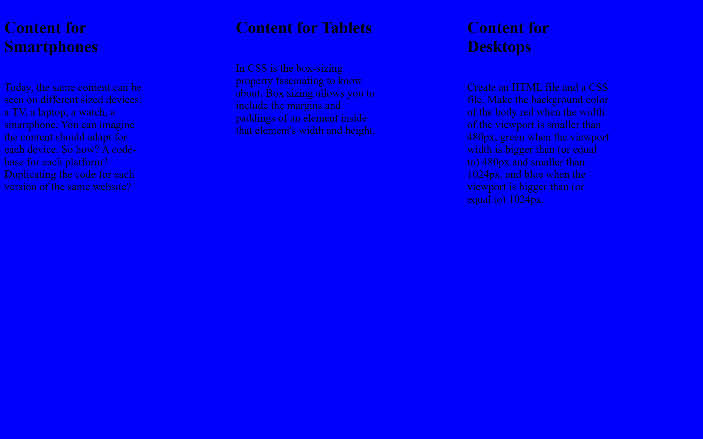
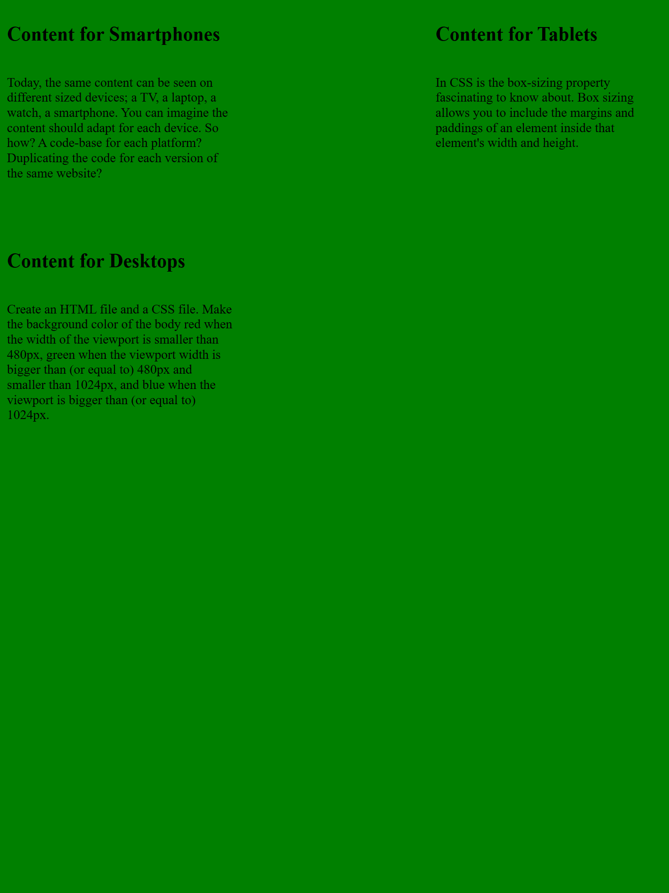
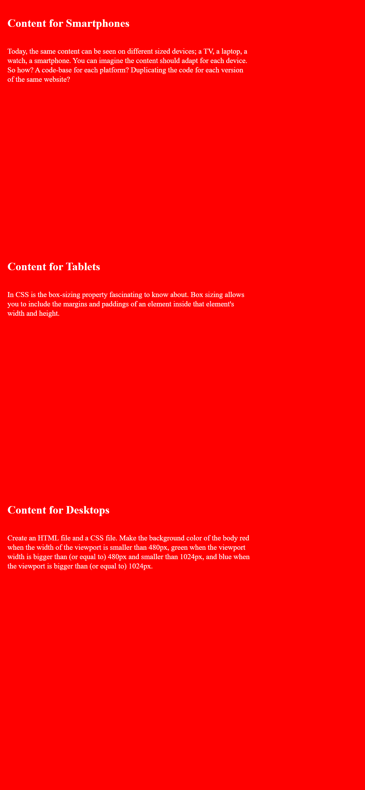
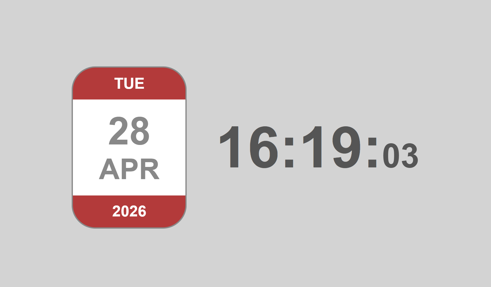

# BeCode Exercises

This repository contains a collection of exercises I completed while following a software development course with BeCode. It reflects my early learning journey, focusing on building a solid foundation in JavaScript, HTML, CSS, and responsive design.

The repository is organized into three main folders, each targeting a different area of development.

---

##  Repository Structure

### 1. `javascript`
This folder contains a series of JavaScript exercises organized by topic. Each subfolder focuses on a specific concept and includes:
- `0.Assignment-Instructions.md` → Description of the exercises
- `.js` files → My solutions

**Topics covered:**
- Intro (basic syntax, variables)
- Control Structures (conditionals and loops)
- Arrays
- Functions
- Objects
- Classes (ES6 and OOP basics)

---

### 2. `progressive-enhancement`
This folder focuses on HTML and CSS, with an emphasis on layout techniques and responsive design.

It contains three main exercises:  

  

    <ul>
      <li><strong>The Chinese Farmer</strong></li>
      <ul>
      <li>Practice of basic HTML structure and CSS styling</li>
      </ul>
    </ul>
  

  

    
  

  

  

    <ul>
      <li><strong>V-Card</strong></li>
        <ul>
          <li>A personal card layout built in two versions:</li>
            <ul>
              <li>One using <strong>CSS Grid</strong></li>
              <li>One using <strong>Flexbox</strong></li>
            </ul>
          <li>The goal was to understand and compare both layout systems</li>
        </ul>
    </ul>
  

    

  

  

    <ul>
      <li><strong>Responsive Layout Exercise</strong></li>
        <ul>
          <li>A layout with three paragraphs with colored background that adapts to screen size:</li>
            <ul>
              <li><strong>Large screens: </strong>3 columns, blue background</li>
              <li><strong>Medium screens: </strong>2 columns, green background</li>
              <li><strong>Small screens: </strong>1 column, red background (stacked rows)</li>
            </ul>
        </ul>
    </ul>
  

    
    
    

  

---

### 3. `dates`
This folder contains exercises related to working with dates in JavaScript, helping reinforce understanding of time-based logic and built-in Date methods. 

 

---

##  Purpose

The goal of this repository is to:
- Practice and reinforce core development concepts
- Track my progress as I learn
- Build a reference of fundamental patterns and techniques
- Experiment with different approaches (e.g., Grid vs Flexbox)

---

## Notes

These exercises represent early-stage learning and experimentation. The focus is on understanding concepts rather than producing production-ready code.
